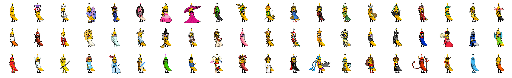

# WAGMI Studios' Layer-cake 🍴

#### Commercial NFT compositing, layering, metadata generation tooling

Layer-cake fork ensures that WAGMI is going to make it

<p align="center"></p>

---

<p align="center"></p>

#### veBanny, and the BannyVerse

This repo contains the project-config for veBanny and an preview veBanny accessories of which the BannyVerse will see in some shape or form. [BannyVerse](https://bannyverse.xyz) will launch shortly or along side the veBanny launch.

veBanny represents 60 Banny characters centered on a token range and duration star field to signify 300 locked positions.

#### Install, build

```bash
yarn
yarn build
```

#### Generate use

```bash
yarn run start
```

---

#### [Layers](Layering.md)

Layer-cake has generated a fuck-ton of NFTs. I apologize to the Earth. I will off-set the carbon footprint.

- [All OneOf NFTs](https://www.oneof.com/)
  - [GloGang](https://music.oneof.com/drops/0ec3d70e-64e1-416f-b18d-bfbd3fe3a667/details)
  - [GloBabies](https://music.oneof.com/drops/3b5d928e-b266-4dfe-8ce2-5c2029a9116b/details)
  - [Identity](https://music.oneof.com/drops/2f12a235-1538-42bb-8248-40dcb5783f5d/details-live)
  - [Grammy's](https://music.oneof.com/drops/a1aee48b-ec4c-4eaf-a218-74520309834d/details-live)
  - [Pia Mia: Birth of D1AD3MA](https://music.oneof.com/drops/cc8650e7-973b-4a04-a017-d66a7b3cd35b/details)
- [Meows(DAO)](https://gallery.so/meowsdao)
- [Movement DAO's Apes](https://opensea.io/collection/movement-daos-ascended-ape-collection)

#### [Typical Project config](Example.md) - MeowsDAO

<p align="center">
  
</p>

Following the project config link reveals a complete example, however, once files are placed in `layer_assets` specifying the order the layers are to be composed is pretty useful. Note within the `Project Config` `layer order` must correspond with `trait folders`.

```typescript
...
      layer_order: [
        'Background',
        'Fur',
        'Ears',
        'Eyes',
        'Nose',
        'Brows',
        'Nipples',
        'Headwear',
        'Glasses',
        'Collar',
        'Signature',
      ],
...
```

### resume_folder

Leave this blank at first to create an output folder and composite images.

Once image composition is completed, you may place the name of the output folder in this field, in order to pick up where you left off with uploading etc.

### upload_images_to_ipfs

If true, and images are ready for upload, the system will upload to nft.storage in small batches over time.

The system will frequently save state while allowing the service to "rest". If you need to Ctrl-C out, don't do it when it's saving state please (but rather, just as it starts uploading a block of assets).

Once the state is saved for a successfully uploaded block of assets, they will not be uploaded again. This means if you exit and then re-enter this mode, it will skip over finished assets and generally pick up where it left off.

### upload_metadata_to_ipfs

If true, and metadata is ready for upload, the system will upload to nft.storage in small batches.

The process of managing batches and state is the same as for upload_images_to_ipfs, so the same notes above, apply equally here.

### image_outputs

By default, the original image size from the layers, will be output in the 'original' folder.

Here, you may specify additional output image sizes.

The `tag` property is used to organize the outputs in folders.

The `ipfs_tag` (generally a single character) is used to signify whether the given output should be uploaded to IPFS (empty means no), and is used as a suffix to name the file in the output directories as well as in IPFS. E.g., you might have an 'icon' output with an ipfs_tag of 's' (for small); this will be named something like 0001s.png, and would be addressed in IPFS via [CID]/0001s.png.

## Run

```bash
yarn ts-node ./src/index.ts
```

## Lint

```bash
yarn run prettier
```

## Specify rare layer files

Name an input file appended with '\_r' or '\_u', followed by numbers, to signify the file should have an enforced rarity.

Name an input file similar to Hat_r12.png to signify that the given file may be used 12% of the time in the relevant (sub) population.

A name similar to Hat_r01.png will be interpreted to mean the file may be used 0.01% of the time.

(Note this implies there is no way to express e.g. 0.1% at present.)

A name similar to Hat_u12.png will be used at most 12 times.

In the event that the stated percentage would imply less than one allowed usage, exactly one will be allowed.

### Reference

`ffmpeg -f image2 -framerate 1 -i %03d.png -loop -1 animation.gif`
